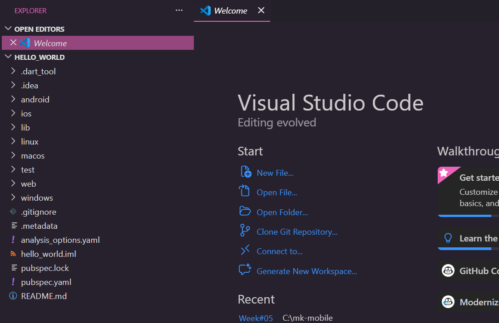
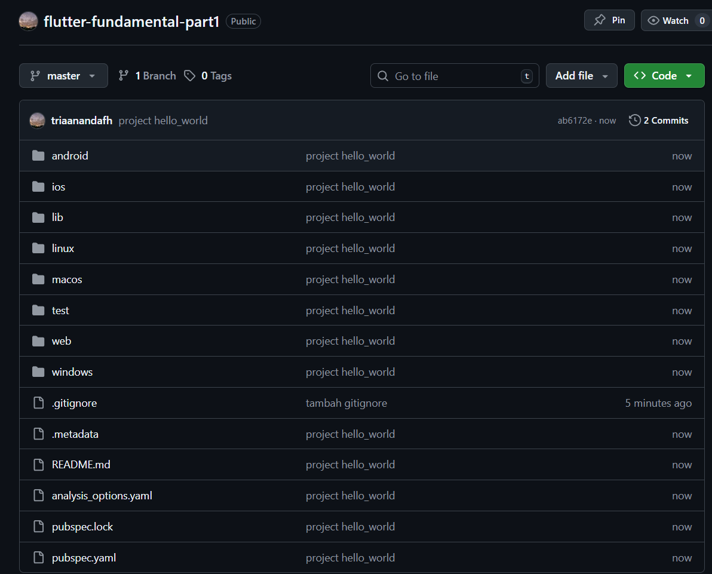
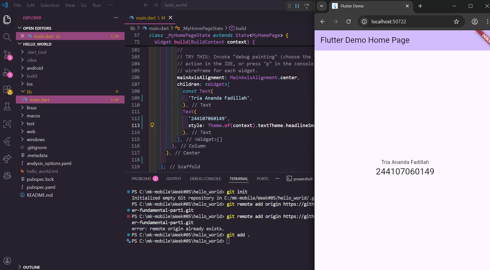
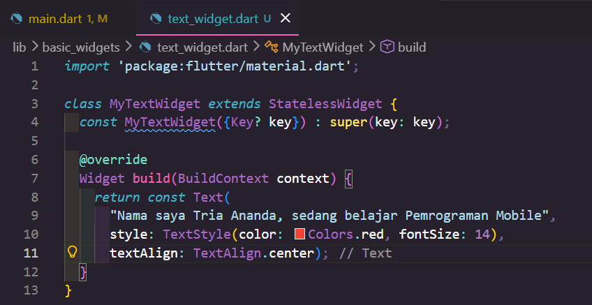
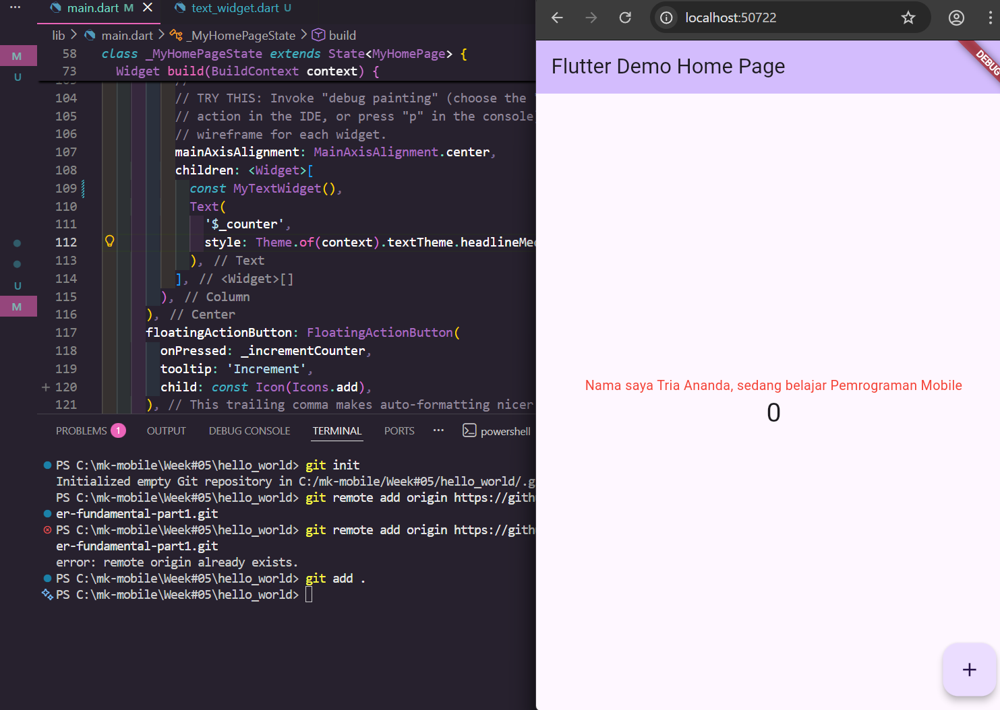
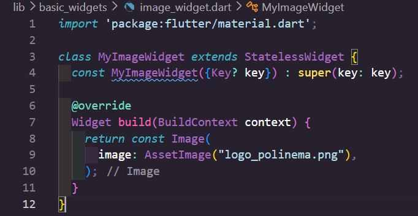
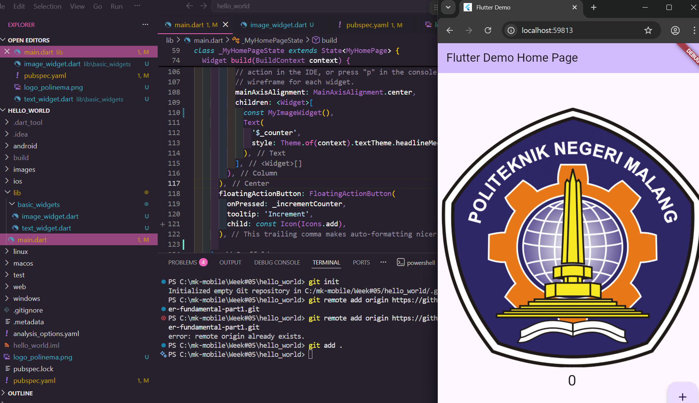

# Laporan Praktikum Pemrograman Mobile - Week 05
**Nama**: Tria Ananda  
**NIM**: 244107060149  
**Kelas**: SIB 2G  

---

## 📱 Praktikum 1: Membuat Project Flutter Baru
Pada praktikum ini, Project Flutter baru berhasil dibuat dengan nama project 'hello_world'

**Langkah Penanganan:**
1. Buka VS Code, lalu tekan tombol Ctrl + Shift + P maka akan tampil Command Palette, lalu ketik Flutter. Pilih New Application Project
2. Kemudian buat folder sesuai style laporan praktikum yang Anda pilih. Disarankan pada folder dokumen atau desktop atau alamat folder lain yang tidak terlalu dalam atau panjang. Lalu pilih Select a folder to create the project in. 
3. Buat nama project flutter hello_world. Tunggu hingga proses pembuatan project baru selesai.
4. Jika sudah selesai proses pembuatan project baru, pastikan tampilan seperti berikut. Pesan akan tampil berupa "Your Flutter Project is ready!" artinya Anda telah berhasil membuat project Flutter baru.

> **Screenshot Hasil di Perangkat Fisik:**
> 

---
## 📱 Praktikum 2: Menghubungkan Perangkat Android atau Emulator
Pada praktikum ini, aplikasi `hello_world` berhasil dijalankan pada perangkat fisik menggunakan mode **Debug**.

**Langkah Penanganan:**
1. Mengaktifkan **Developer Options** dan **USB Debugging** pada perangkat HP.
2. Menghubungkan perangkat ke VS Code melalui kabel data/Wi-Fi.
3. Menjalankan perintah `flutter run`.

> **Screenshot Hasil di Perangkat Fisik:**
> 

---

## 📱 Praktikum 3: Membuat Repository Github dan Laporan Praktikum
Pada praktikum ini, repository baru bernama flutter-fundamental-part1 berhasil dibuat. 

**Langkah Penanganan:**
1. Login ke akun Github, lalu buat repository baru dengan nama "flutter-fundamental-part1"
2. Lalu klik tombol "Create repository" lalu akan tampil seperti gambar berikut.
3. Kembali ke VS code, project flutter hello_world, buka terminal pada menu Terminal > New Terminal. Lalu ketik perintah berikut untuk inisialisasi git pada project Anda.
4. Pilih menu Source Control di bagian kiri, lalu lakukan stages (+) pada file .gitignore untuk mengunggah file pertama ke repository GitHub.
5. Beri pesan commit "tambah gitignore" lalu klik Commit (✔)
6. Lakukan push dengan klik bagian menu titik tiga > Push
7. Di pojok kanan bawah akan tampil seperti gambar berikut. Klik "Add Remote"
8.	Salin tautan repository Anda dari browser ke bagian ini, lalu klik Add remote. Setelah berhasil, tulis remote name dengan "origin"
10.	Lakukan push juga untuk semua file lainnya dengan pilih Stage All Changes. Beri pesan commit "project hello_world". Maka akan tampil di repository GitHub Anda seperti berikut.
11. Kembali ke VS Code, ubah platform di pojok kanan bawah ke emulator atau device atau bisa juga menggunakan browser Chrome. Lalu coba running project hello_world dengan tekan F5 atau Run > Start Debugging. Tunggu proses kompilasi hingga selesai, maka aplikasi flutter pertama Anda akan tampil seperti berikut.

> **Screenshot Hasil di Perangkat Fisik:**
> 
> 

---

## 📱 Praktikum 4: Menerapkan Widget Dasar
Pada praktikum ini, aplikasi `hello_world` berhasil dijalankan pada perangkat fisik menggunakan mode **Debug**.

**Langkah 1: Text Widget**
1. Buat folder baru basic_widgets di dalam folder lib. Kemudian buat file baru di dalam basic_widgets dengan nama text_widget.dart. Ketik atau salin kode program berikut ke project hello_world Anda pada file text_widget.dart. 
2. Lakukan import file text_widget.dart ke main.dart, lalu ganti bagian text widget dengan kode di atas. Maka hasilnya seperti gambar berikut. 

> **Screenshot Hasil di Perangkat Fisik:**
> 
> 

**Langkah 2: Image Widget**
1. Buat sebuah file image_widget.dart di dalam folder basic_widgets dengan isi kode berikut.
2. Lakukan penyesuaian asset pada file pubspec.yaml dan tambahkan file logo Anda di folder assets project hello_world.
3. Jangan lupa sesuaikan kode dan import di file main.dart kemudian akan tampil gambar seperti berikut.

> **Screenshot Hasil di Perangkat Fisik:**
> 
> 

---

## 📱 Praktikum 5: Menerapkan Widget Material Design dan Ios Cupertino
Pada praktikum ini, aplikasi `hello_world` berhasil dijalankan pada perangkat fisik menggunakan mode **Debug**.

**Langkah 1: Cupertino Button dan Loading Bar**
1. Buat file di basic_widgets > loading_cupertino.dart. Import stateless widget dari material dan cupertino. Lalu isi kode di dalam method Widget build adalah sebagai berikut.

> **Screenshot Hasil di Perangkat Fisik:**
> 

**Langkah 2: Floating Action Button (FAB)**
1. Button widget terdapat beberapa macam pada flutter yaitu ButtonBar, DropdownButton, TextButton, FloatingActionButton, IconButton, OutlineButton, PopupMenuButton, dan ElevatedButton.
Buat file di basic_widgets > fab_widget.dart. 
2. Import stateless widget dari material. Lalu isi kode di dalam method Widget build adalah sebagai berikut

> **Screenshot Hasil di Perangkat Fisik:**
> 

**Langkah 3: Scaffold Widget**
1. Scaffold widget digunakan untuk mengatur tata letak sesuai dengan material design.
Ubah isi kode main.dart seperti berikut.

> **Screenshot Hasil di Perangkat Fisik:**
> 

**Langkah 4: Dialog Widget**
1. Dialog widget pada flutter memiliki dua jenis dialog yaitu AlertDialog dan SimpleDialog. Ubah isi kode main.dart seperti berikut.

> **Screenshot Hasil di Perangkat Fisik:**
> 

**Langkah 5: Input dan Selection Widget**
1. Flutter menyediakan widget yang dapat menerima input dari pengguna aplikasi yaitu antara lain Checkbox, Date and Time Pickers, Radio Button, Slider, Switch, TextField.
Contoh penggunaan TextField widget adalah sebagai berikut:

> **Screenshot Hasil di Perangkat Fisik:**
> 

**Langkah 6: Date and Time Pickers**
1. Date and Time Pickers termasuk pada kategori input dan selection widget, berikut adalah contoh penggunaan Date and Time Pickers.

> **Screenshot Hasil di Perangkat Fisik:**
> 

---

## 📂 Struktur Project (Modularization)
Sesuai dengan praktik *Clean Code*, widget-widget di atas telah dipisahkan ke dalam file tersendiri di dalam folder `lib/basic_widgets/` untuk meningkatkan keterbacaan kode:
* `text_widget.dart`
* `image_widget.dart`
* `input_widget.dart`
* `date_picker_widget.dart`

---

## 📸 Dokumentasi Output (GIF)
Berikut adalah demonstrasi interaktif dari aplikasi yang telah mencakup seluruh praktikum (Counter, Input Nama, dan Date Picker):

---
*Laporan ini disusun sebagai pemenuhan tugas mata kuliah Pemrograman Mobile 2026.*